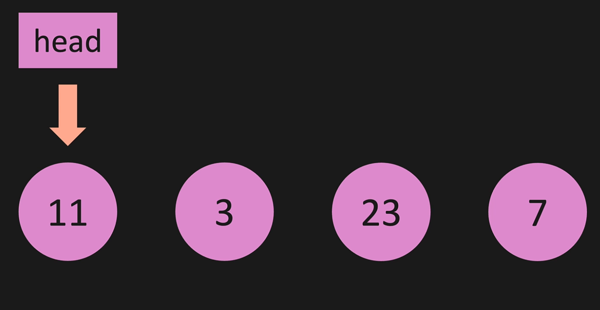
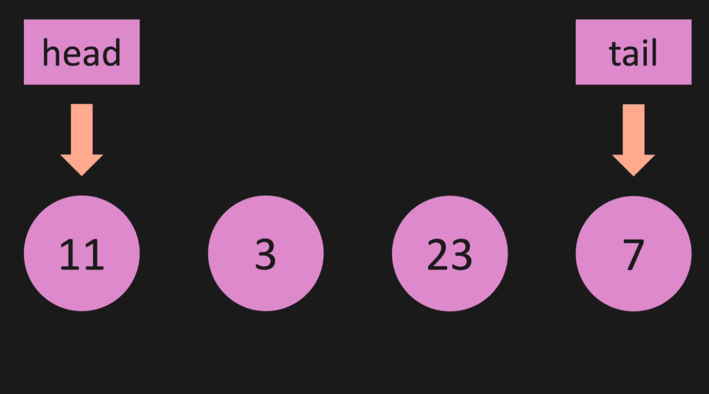
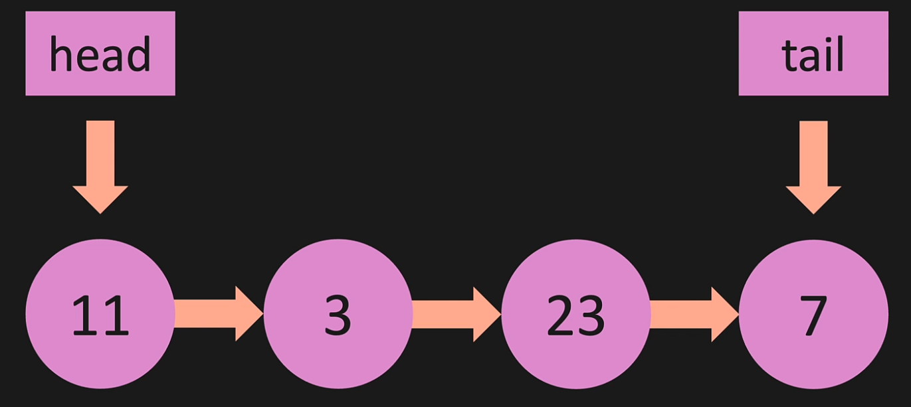
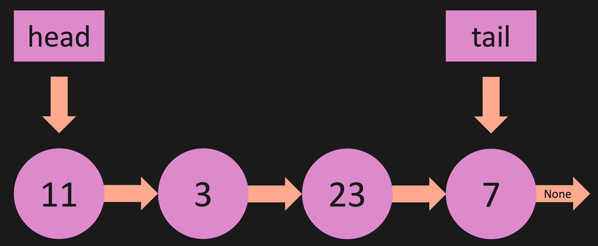

# Introduction

#### As we all know that a list uses indexes, this is onwe difference that exist between a *list* and a *linkedlist*. Secondly, a list is in a contiguous place in memory meaning that all the items are next to each other whereas with the *linkedlist* all nodes are going to be spread all over the place.

#### Something to take note of is that in a linked list we have a variable called *head* and it points to the first node in the list as shown in the first Image and we will also have a *tale* to the last item as shown in the second Image, and then, each node points to the next as shown in the third Image. And then, the last one is just going to point to None as shown in the last Image













### Here is a link for the BigO of performing different operations in a linked list: [BigO ](pictures/BigO.png)


### **Here is an example of using Append:**


```python
class Node:
    def __init__(self, value):
        self.value = value
        self.next = None
        

class LinkedList:
    def __init__(self, value):
        new_node = Node(value)
        self.head = new_node
        self.tail = new_node
        self.length = 1

    def print_list(self):
        temp = self.head
        while temp is not None:
            print(temp.value)
            temp = temp.next
        
    def append(self, value):
        new_node = Node(value)
        if self.length == 0:
            self.head = new_node
            self.tail = new_node
        else:
            self.tail.next = new_node
            self.tail = new_node
        self.length += 1


my_linked_list = LinkedList(1)

my_linked_list.append(2)

my_linked_list.print_list()                                  
```


### **Here is an example of using Prepend:**

```python
class Node:
    def __init__(self, value):
        self.value = value
        self.next = None
        

class LinkedList:
    def __init__(self, value):
        new_node = Node(value)
        self.head = new_node
        self.tail = new_node
        self.length = 1

    def print_list(self):
        temp = self.head
        while temp is not None:
            print(temp.value)
            temp = temp.next
        
    def append(self, value):
        new_node = Node(value)
        if self.length == 0:
            self.head = new_node
            self.tail = new_node
        else:
            self.tail.next = new_node
            self.tail = new_node
        self.length += 1
        return True

    def pop(self):
        if self.length == 0:
            return None
        temp = self.head
        pre = self.head
        while(temp.next):
            pre = temp
            temp = temp.next
        self.tail = pre
        self.tail.next = None
        self.length -= 1
        if self.length == 0:
            self.head = None
            self.tail = None
        return temp

    def prepend(self, value):
        new_node = Node(value)
        if self.length == 0:
            self.head = new_node
            self.tail = new_node
        else:
            new_node.next = self.head
            self.head = new_node
        self.length += 1
        return True


my_linked_list = LinkedList(2)
my_linked_list.append(3)

my_linked_list.prepend(1)

my_linked_list.print_list()
```
### **Here is an example of using Insert:**

```python
class Node:
    def __init__(self, value):
        self.value = value
        self.next = None
        

class LinkedList:
    def __init__(self, value):
        new_node = Node(value)
        self.head = new_node
        self.tail = new_node
        self.length = 1

    def print_list(self):
        temp = self.head
        while temp is not None:
            print(temp.value)
            temp = temp.next
        
    def append(self, value):
        new_node = Node(value)
        if self.length == 0:
            self.head = new_node
            self.tail = new_node
        else:
            self.tail.next = new_node
            self.tail = new_node
        self.length += 1
        return True

    def pop(self):
        if self.length == 0:
            return None
        temp = self.head
        pre = self.head
        while(temp.next):
            pre = temp
            temp = temp.next
        self.tail = pre
        self.tail.next = None
        self.length -= 1
        if self.length == 0:
            self.head = None
            self.tail = None
        return temp

    def prepend(self, value):
        new_node = Node(value)
        if self.length == 0:
            self.head = new_node
            self.tail = new_node
        else:
            new_node.next = self.head
            self.head = new_node
        self.length += 1
        return True

    def pop_first(self):
        if self.length == 0:
            return None
        temp = self.head
        self.head = self.head.next
        temp.next = None
        self.length -= 1
        if self.length == 0:
            self.tail = None
        return temp

    def get(self, index):
        if index < 0 or index >= self.length:
            return None
        temp = self.head
        for _ in range(index):
            temp = temp.next
        return temp
        
    def set_value(self, index, value):
        temp = self.get(index)
        if temp:
            temp.value = value
            return True
        return False
    
    def insert(self, index, value):
        if index < 0 or index > self.length:
            return False
        if index == 0:
            return self.prepend(value)
        if index == self.length:
            return self.append(value)
        new_node = Node(value)
        temp = self.get(index - 1)
        new_node.next = temp.next
        temp.next = new_node
        self.length += 1   
        return True  
  

my_linked_list = LinkedList(0)
my_linked_list.append(2)

my_linked_list.insert(1,1)

my_linked_list.print_list()
```


### **Here is an example of using remove:**


```python
class Node:
    def __init__(self, value):
        self.value = value
        self.next = None
        

class LinkedList:
    def __init__(self, value):
        new_node = Node(value)
        self.head = new_node
        self.tail = new_node
        self.length = 1

    def print_list(self):
        temp = self.head
        while temp is not None:
            print(temp.value)
            temp = temp.next
        
    def append(self, value):
        new_node = Node(value)
        if self.length == 0:
            self.head = new_node
            self.tail = new_node
        else:
            self.tail.next = new_node
            self.tail = new_node
        self.length += 1
        return True

    def pop(self):
        if self.length == 0:
            return None
        temp = self.head
        pre = self.head
        while(temp.next):
            pre = temp
            temp = temp.next
        self.tail = pre
        self.tail.next = None
        self.length -= 1
        if self.length == 0:
            self.head = None
            self.tail = None
        return temp

    def prepend(self, value):
        new_node = Node(value)
        if self.length == 0:
            self.head = new_node
            self.tail = new_node
        else:
            new_node.next = self.head
            self.head = new_node
        self.length += 1
        return True

    def pop_first(self):
        if self.length == 0:
            return None
        temp = self.head
        self.head = self.head.next
        temp.next = None
        self.length -= 1
        if self.length == 0:
            self.tail = None
        return temp

    def get(self, index):
        if index < 0 or index >= self.length:
            return None
        temp = self.head
        for _ in range(index):
            temp = temp.next
        return temp
        
    def set_value(self, index, value):
        temp = self.get(index)
        if temp:
            temp.value = value
            return True
        return False
    
    def insert(self, index, value):
        if index < 0 or index > self.length:
            return False
        if index == 0:
            return self.prepend(value)
        if index == self.length:
            return self.append(value)
        new_node = Node(value)
        temp = self.get(index - 1)
        new_node.next = temp.next
        temp.next = new_node
        self.length += 1   
        return True  

    def remove(self, index):
        if index < 0 or index >= self.length:
            return None
        if index == 0:
            return self.pop_first()
        if index == self.length - 1:
            return self.pop()
        pre = self.get(index - 1)
        temp = pre.next
        pre.next = temp.next
        temp.next = None
        self.length -= 1
        return temp
  

my_linked_list = LinkedList(11)
my_linked_list.append(3)
my_linked_list.append(23)
my_linked_list.append(7)

print(my_linked_list.remove(2), '\n')

my_linked_list.print_list()
```
### **Here is an example of using Reverse:**

```python
class Node:
    def __init__(self, value):
        self.value = value
        self.next = None
        

class LinkedList:
    def __init__(self, value):
        new_node = Node(value)
        self.head = new_node
        self.tail = new_node
        self.length = 1

    def print_list(self):
        temp = self.head
        while temp is not None:
            print(temp.value)
            temp = temp.next
        
    def append(self, value):
        new_node = Node(value)
        if self.length == 0:
            self.head = new_node
            self.tail = new_node
        else:
            self.tail.next = new_node
            self.tail = new_node
        self.length += 1
        return True

    def pop(self):
        if self.length == 0:
            return None
        temp = self.head
        pre = self.head
        while(temp.next):
            pre = temp
            temp = temp.next
        self.tail = pre
        self.tail.next = None
        self.length -= 1
        if self.length == 0:
            self.head = None
            self.tail = None
        return temp

    def prepend(self, value):
        new_node = Node(value)
        if self.length == 0:
            self.head = new_node
            self.tail = new_node
        else:
            new_node.next = self.head
            self.head = new_node
        self.length += 1
        return True

    def pop_first(self):
        if self.length == 0:
            return None
        temp = self.head
        self.head = self.head.next
        temp.next = None
        self.length -= 1
        if self.length == 0:
            self.tail = None
        return temp

    def get(self, index):
        if index < 0 or index >= self.length:
            return None
        temp = self.head
        for _ in range(index):
            temp = temp.next
        return temp
        
    def set_value(self, index, value):
        temp = self.get(index)
        if temp:
            temp.value = value
            return True
        return False
    
    def insert(self, index, value):
        if index < 0 or index > self.length:
            return False
        if index == 0:
            return self.prepend(value)
        if index == self.length:
            return self.append(value)
        new_node = Node(value)
        temp = self.get(index - 1)
        new_node.next = temp.next
        temp.next = new_node
        self.length += 1   
        return True  

    def remove(self, index):
        if index < 0 or index >= self.length:
            return None
        if index == 0:
            return self.pop_first()
        if index == self.length - 1:
            return self.pop()
        pre = self.get(index - 1)
        temp = pre.next
        pre.next = temp.next
        temp.next = None
        self.length -= 1
        return temp

    def reverse(self):
        temp = self.head
        self.head = self.tail
        self.tail = temp
        after = temp.next
        before = None
        for _ in range(self.length):
            after = temp.next
            temp.next = before
            before = temp
            temp = after
  

my_linked_list = LinkedList(1)
my_linked_list.append(2)
my_linked_list.append(3)
my_linked_list.append(4)

my_linked_list.reverse()

my_linked_list.print_list()
```