# Introduction

#####  We have already seen a *Tree* in the previous tutorial, that is a *Linkedlist*. So, a linked list is a just a tree which doesn't fork but, it is actually a form of a tree.

##### So, in a binary tree we will have a node with two arrows like so:

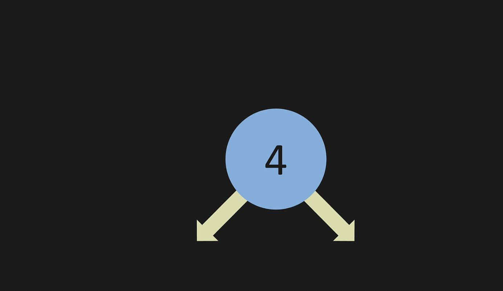

##### And this will look like so:

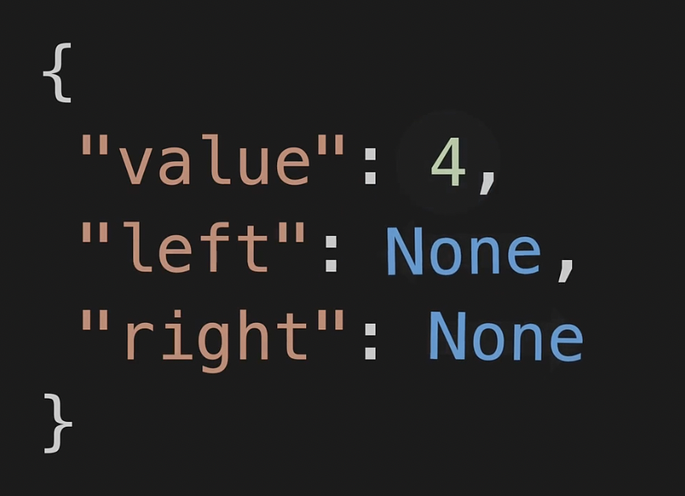

##### The Node has a value and in this case its 4 and both left, and right arrows are set to None. :

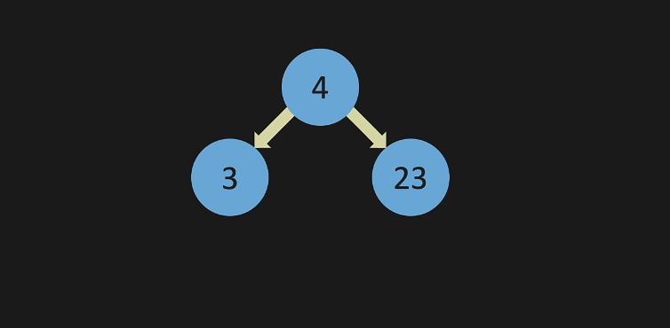
#### If you have something like this, you can think about it as dictionaries. like so:

#### Note that this is essentially the same as the picture above which is pretty easier to look at.

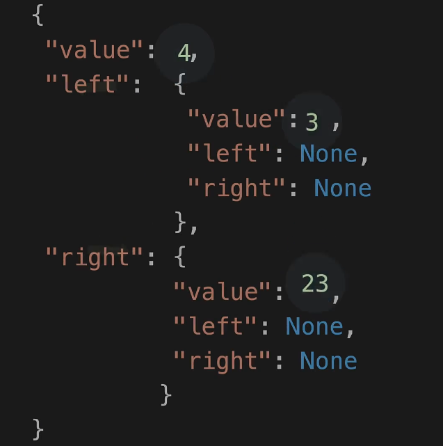


#### The Children nodes can also point to other nodes like this:
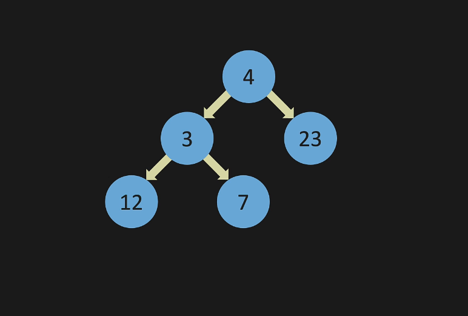


##### Lets look at some terminology. This is what is called full and a full tree. Every nodecan either point to zero node nodes or two nodes.
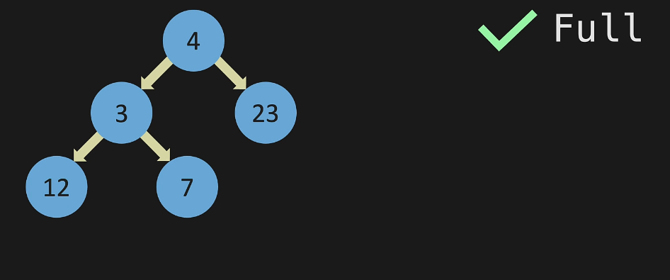

##### The 7 node is only pointing to only one node, so it is nolonger full as shown below:

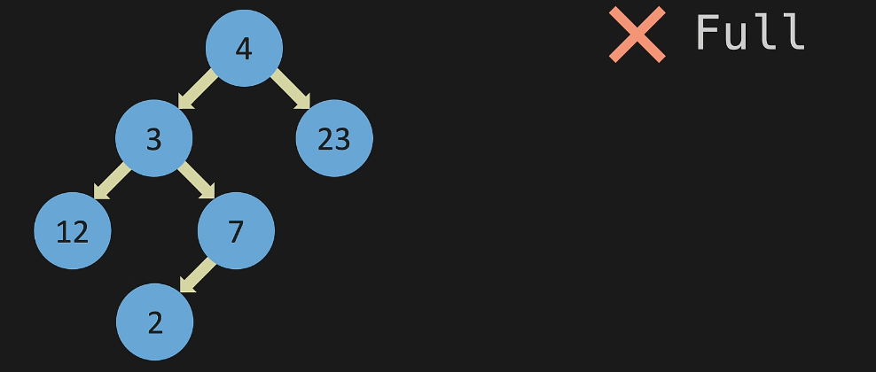

##### With a perfect tree, any level in the tree tht has any nodes is completely filled all the way across. So this is a perfect tree as shown below:
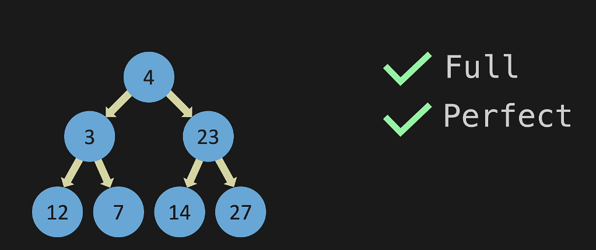

##### This Node here is the parent
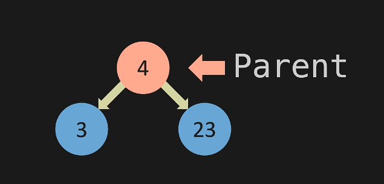
##### of these two child nodes, because they share the same parent, are also called siblings. Note that every node can only have one parent, so if you see something where a node has more than one parent then it is not a *Tree*. Child nodes can also be parent nodes. 
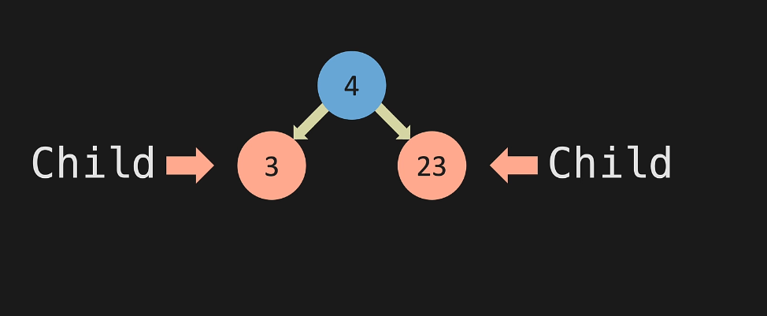

##### A node with with any children it is called a *Leaf* as shown below:
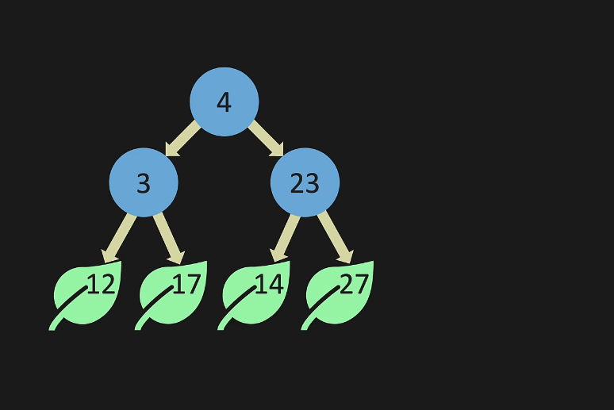


### Remember that to insert or remove in a Tree is 0(log n).This is achived by doing divide and conquer. Our worst case scenario is achieved when the tree never forks like so:
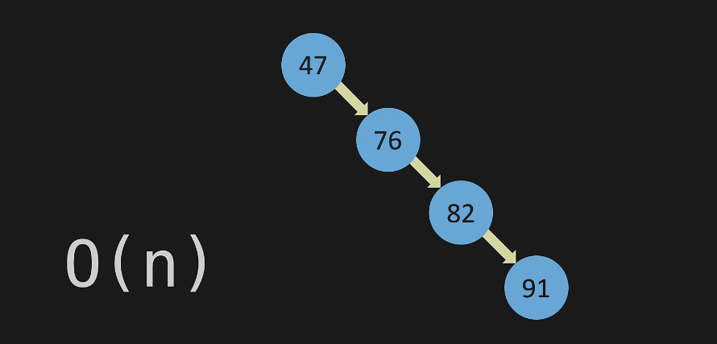
### This becomes a linkedlist instead of a Tree and, this will be 0(n). But, out best case scenario is achieved as as we assume that the tree will fork.

## Here is an Example of **Insert** in BST:

```python
class Node:
    def __init__(self, value):
        self.value = value
        self.left = None
        self.right = None
        

class BinarySearchTree:
    def __init__(self):
        self.root = None

    def insert(self, value):
        new_node = Node(value)
        if self.root is None:
            self.root = new_node
            return True
        temp = self.root
        while (True):
            if new_node.value == temp.value:
                return False
            if new_node.value < temp.value:
                if temp.left is None:
                    temp.left = new_node
                    return True
                temp = temp.left
            else: 
                if temp.right is None:
                    temp.right = new_node
                    return True
                temp = temp.right


my_tree = BinarySearchTree()
my_tree.insert(2)
my_tree.insert(1)
my_tree.insert(3)


print(my_tree.root.value)            
print(my_tree.root.left.value)        
print(my_tree.root.right.value)  
```


## Here is an example of **Contains** in BST:

```python

class Node:
    def __init__(self, value):
        self.value = value
        self.left = None
        self.right = None
        

class BinarySearchTree:
    def __init__(self):
        self.root = None

    def insert(self, value):
        new_node = Node(value)
        if self.root is None:
            self.root = new_node
            return True
        temp = self.root
        while (True):
            if new_node.value == temp.value:
                return False
            if new_node.value < temp.value:
                if temp.left is None:
                    temp.left = new_node
                    return True
                temp = temp.left
            else: 
                if temp.right is None:
                    temp.right = new_node
                    return True
                temp = temp.right

    def contains(self, value):
        temp = self.root
        while (temp is not None):
            if value < temp.value:
                temp = temp.left
            elif value > temp.value:
                temp = temp.right
            else:
                return True
        return False
        


my_tree = BinarySearchTree()
my_tree.insert(47)
my_tree.insert(21)
my_tree.insert(76)
my_tree.insert(18)
my_tree.insert(27)
my_tree.insert(52)
my_tree.insert(82)


print(my_tree.contains(27))

print(my_tree.contains(17))
```


# Problem to Solve:

## Find and return the node with the minimum value.

```python
class Node:
    def __init__(self, value):
        self.value = value
        self.left = None
        self.right = None
        

class BinarySearchTree:
    def __init__(self):
        self.root = None

    def insert(self, value):
        new_node = Node(value)
        if self.root is None:
            self.root = new_node
            return True
        temp = self.root
        while (True):
            if new_node.value == temp.value:
                return False
            if new_node.value < temp.value:
                if temp.left is None:
                    temp.left = new_node
                    return True
                temp = temp.left
            else: 
                if temp.right is None:
                    temp.right = new_node
                    return True
                temp = temp.right
        
    def min_value_node(self, current_node):
        while current_node.left is not None:
        #   Solve here


my_tree = BinarySearchTree()
my_tree.insert(47)
my_tree.insert(21)
my_tree.insert(76)
my_tree.insert(18)
my_tree.insert(27)
my_tree.insert(52)
my_tree.insert(82)

print(my_tree.min_value_node(my_tree.root))
print(my_tree.min_value_node(my_tree.root.right)) result 18, 52
```


### Please click this link after you have completed the problem on your own [Solution](BTSsolution.py)